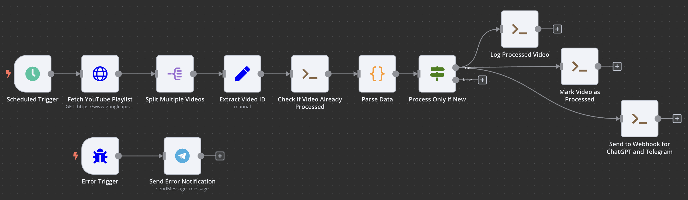
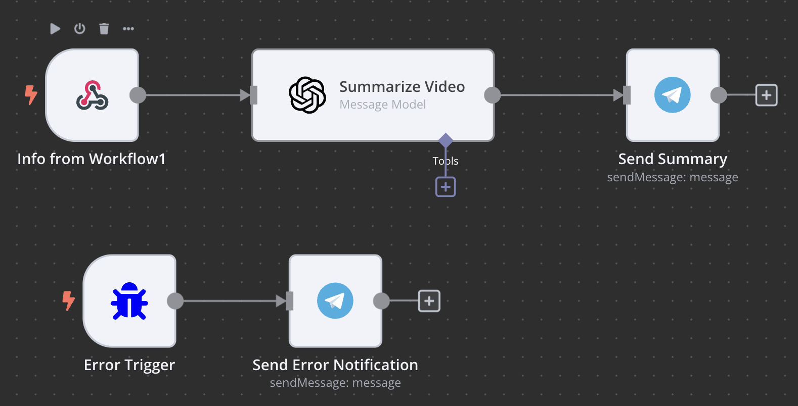

# YouTube Playlist Summarizer (n8n Workflow)


This project automates the process of summarizing new YouTube videos from a playlist and delivering them directly to Telegram.  
It eliminates the need to manually watch each video while ensuring you stay up to date with concise, AI-generated summaries.

**Tech Stack:** n8n, Docker, OpenAI API, Telegram API, YouTube Data API

---

## Table of Contents
- [Folder Structure](#folder-structure)
- [Use Case](#use-case)
- [Workflow Overview](#workflow-overview)
- [Prerequisites](#prerequisites)
- [Setup & Configuration](#setup--configuration)
- [How it Works (Step by Step)](#how-it-works-step-by-step)
- [Screenshots](#screenshots)
- [Key Learnings & Next Steps](#key-learnings--next-steps)
- [Credits](#credits)

---

## Folder Structure

```
.
├── .gitignore
├── LICENSE
├── README.md
├── yt_transcript.py         # Helper script: fetches YouTube transcripts and forwards them to n8n
├── img/
│   ├── first_workflow.png
│   └── second_workflow.png
├── logs/
│   └── yt_processed_ids.txt
├── n8n/
│   ├── YouTube_Playlist_Summarizer.json
│   └── YouTube_Transcript_Handler.json
```

---

## Use Case

You want to receive regular, concise summaries of all new videos added to a YouTube playlist—without having to watch every video in full.

---

## Workflow Overview

This n8n workflow:

- Retrieves all new videos from a specified YouTube playlist.
- Downloads the transcript for each video (if available).
- Uses AI (OpenAI) to summarize the content.
- Sends the summary (including the video title) to a Telegram chat.

---

## Prerequisites

- A running [n8n](https://n8n.io/) instance (Docker, cloud, or self-hosted)
- A [YouTube Data API key](https://developers.google.com/youtube/v3/getting-started)
- An [OpenAI API key](https://platform.openai.com/)
- A [Telegram Bot Token and chat ID](https://core.telegram.org/bots#how-do-i-create-a-bot)

---

## Setup & Configuration

1. **Clone or download this repository.**
2. **Import both workflow files** (`n8n/YouTube_Playlist_Summarizer.json` and `n8n/YouTube_Transcript_Handler.json`) into your n8n instance.
3. **Install Python dependencies** for the transcript helper:
   ```bash
   pip install youtube-transcript-api requests
4. **Configure credentials in n8n:**
    - YouTube API Key
	- OpenAI API Key (or alternative LLM service)
	- Telegram Bot Token and Chat ID
5. **Set your desired YouTube Playlist ID in the appropriate node.**
6. **Configure a schedule trigger** for fully automated execution.

---

## How it Works (Step by Step)

1. **Trigger:** The workflow runs manually or on a scheduled basis.
2. **YouTube Playlist Check:** Retrieves a list of videos and identifies new entries.
3. **Transcript Retrieval:** The workflow calls the helper script (`yt_transcript.py`) with the video ID. The script fetches the transcript (if available) via `youtube-transcript-api` and forwards it to an n8n webhook.
4. **Summarization:** Sends the transcript to OpenAI for summarization.
5. **Telegram Notification:** Sends the summary (including the title) to your Telegram account.

---

## Screenshots

  
  

*The complete n8n workflow for summarizing YouTube playlists.*

---

## Key Learnings & Next Steps
- Flexible orchestration with n8n; Telegram works well as a fast and reliable delivery channel.
- Limitations: missing transcripts, YouTube API rate limits, and LLM output quality for very long texts.
- Fixes implemented: transcript availability check, retry/backoff logic, chunking and prompt tuning.
- **Originally included an error-notification branch, but removed it due to frequent false positives from temporary API unavailability.**

---

## Credits

- Workflow developed and documented by [Mintberry1628](https://github.com/Mintberry1628)
- Powered by [n8n](https://n8n.io/), [OpenAI](https://openai.com), and the [YouTube Data API](https://developers.google.com/youtube/v3)
- Inspired by the open automation and productivity community

---

**For questions or suggestions, feel free to open an issue or contact me via GitHub.**
